# Custom Split Keyboard

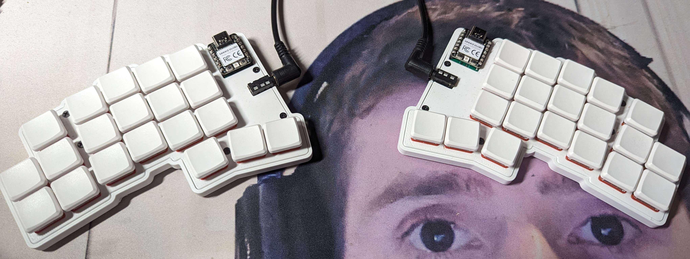

## Introduction
These keyboards are largely inspired by the [Corne Keyboard](https://github.com/qmk/qmk_firmware/tree/master/keyboards/crkbd) as well as the [pica40](https://github.com/qmk/qmk_firmware/tree/master/keyboards/pica40).

The 1st revision of this keyboard is closer in appearance to the Corne, whereas the 2nd revision is a lot closer to the pica40, with my own twist on things of course. This repo serves as more of a blog post for me than what I've done previously.

I had been calling this thing "The Sproggler" for some time, a name inspired by Gen-Z brainrot, however a quick google search revealed a rather unfortunate association with the word on UrbanDictionary. I still want to call it "The Sproggler" though.

The heart of these keyboards are Xiao's RP2040 and nRF52840 boards. These are tiny little boards that pack one heck of a punch, using an ARM Cortex M0+ architecture. The compact design make it perfect for implementing them directly into the keyboard. My [1Keyboard](https://github.com/Brethan/1Keyboard) project makes use of their Xiao SAMD21 board.

Revisions 1 and 2 run QMK firmware with VIA enabled which lets me update the key bindings without re-flashing the keyboard.  
Revision 3 will run ZMK firmware as it was developed with a wireless connectivity first methodology.

All schematics and PCB diagrams were made using KiCad 7.0.  
I was able to export a 3D model from KiCad and import it into Fusion360 which let me really easily design a case for the PCBs.

The final goals for this project are the following:
- A keyboard designed from scratch: Done!
- A portable keyboard I can bring anywhere: Done!
- A quiet keyboard that I could confidently use in a library: WIP
- A wireless keyboard: Not Started

## Table of Contents
- [Custom Split Keyboard](#custom-split-keyboard)
	- [Introduction](#introduction)
	- [Table of Contents](#table-of-contents)
	- [Circuit Schematic](#circuit-schematic)
	- [Revision 1](#revision-1)
		- [In Use (Retired)](#in-use-retired)
		- [3D Model](#3d-model)
		- [PCB Schematic](#pcb-schematic)
		- [Models](#models)
	- [Revision 2](#revision-2)
		- [In Use (Daily Driver)](#in-use-daily-driver)
		- [3D Model](#3d-model-1)
		- [PCB Schematic](#pcb-schematic-1)
		- [Models](#models-1)

## Circuit Schematic
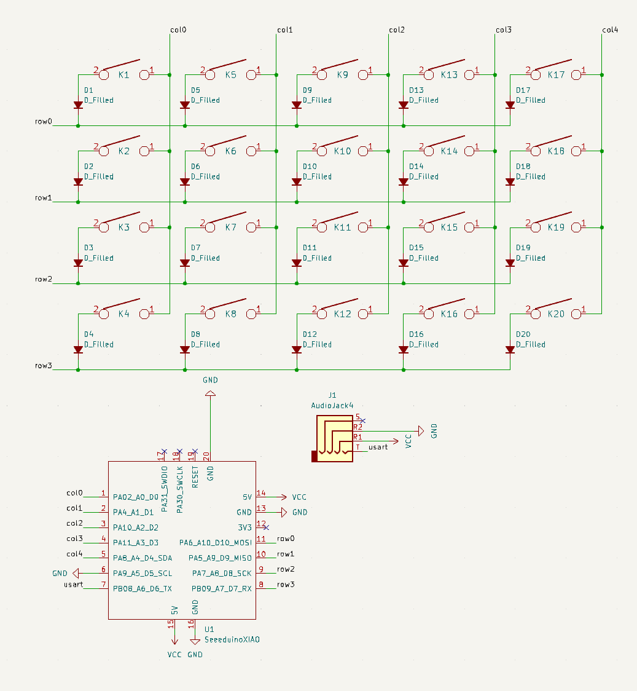
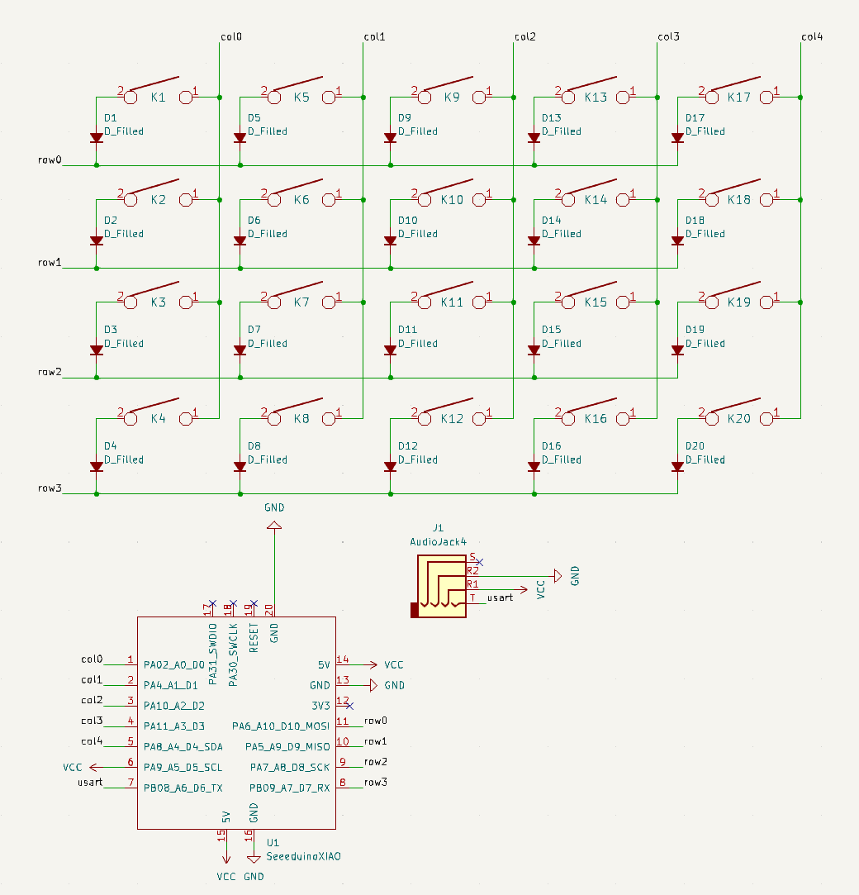

The circuit schematic is identical between revision 1 and 2, so it will be omitted later.
It's a fairly simple row-column matrix, there are 5 columns and 4 rows per board, totalling 40 keys across both halves.

Power and Ground are shared between the boards using an audio jack, and of course, is also how data is transferred from the peripheral board to the master board. Pin 6 is used to identify which board is plugged into the computer (controller), GND indicates the left hand board and VCC indicates the right hand board.

For revision 3, I intend to maintain the same matrix but I also plan on including a battery and power switch as I'd like for revision 3 to be wireless using ZMK.

## Revision 1
This version of the keyboard used MX style switches and through-hole diodes, 1N41484 diodes specifically. 
I had naively included a reset button on the board failing to consider the fact that the Xiao RP2040 has reset button *on* the board.

### In Use (Retired)
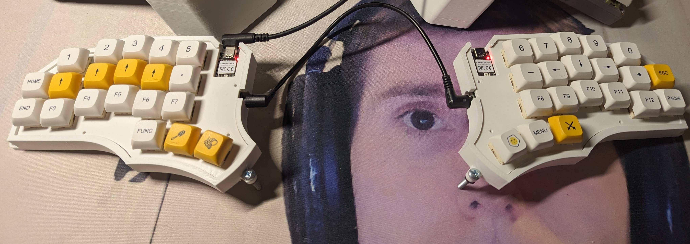

Don't mind the sad Linus mousepad :)   
Feel free to be annoyed by the random use of keycaps, the normal part of the set is being used by my older split keyboard (which you can see the stand-offs of).

I wanted this keyboard to be tented like my old Redox hand-wired keyboard, but I didn't want to do the same thing I had done previously, which was to print large stand-offs for the keyboard and fasten the board and the stand-off together. I wanted something more dynamic. 

For this keyboard, I designed rings on various ends of the case that you can pass screws through (you can see this above). That worked okay, but I needed to get rubber pads on the ends of those screws if I wanted them not to slip and scratch Linus' face.

I mention this below, but you can almost see the spacing of the keys and that's just not comfortable for my hands.

### 3D Model
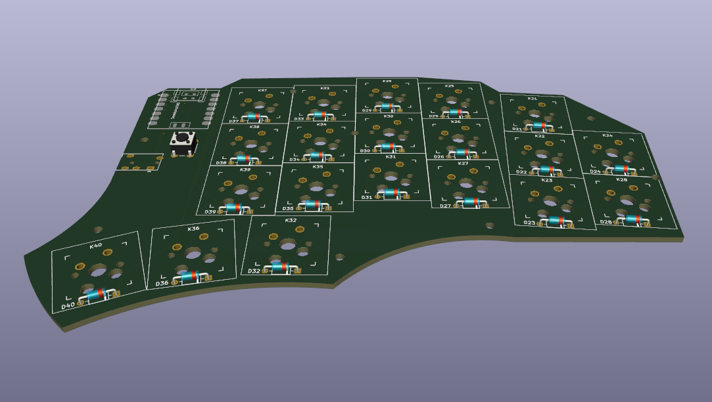

The box around the switch footprint ended up being too large for my liking, the keys had far too much space in between them and it was not totally comfortable to type on. Routing the diodes was a bit of a pain as well, I wanted to reduce the size of this thing as much as I could without opting for surface mounted diodes.

### PCB Schematic
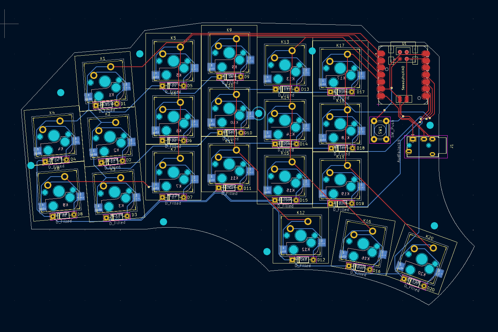
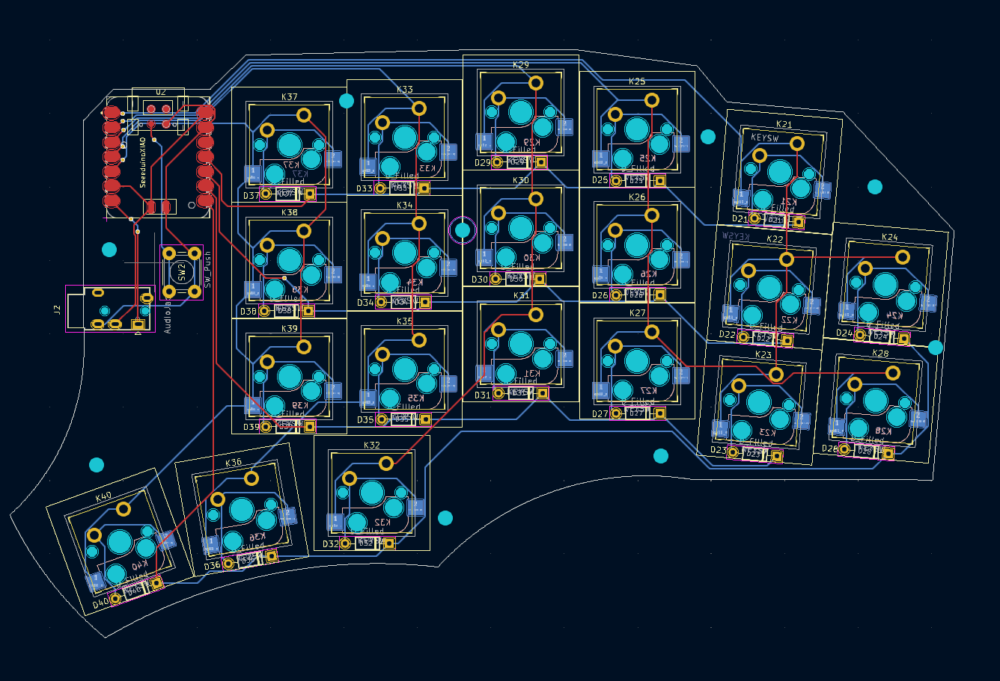

The routing in this board is very amateurish. This was my first time designing a PCB on my own.
I'm also not particularly happy with how the edge cuts look. I found the design tools in KiCad to be super awkward to use
and it ended up looking pretty weird.

The 2 index finger columns didn't have much of a stagger in practice, so I found that it didn't really help with how moving the index finger over also lowers it a little. The Rev2 exaggerates the stagger a bit more.

I placed the footprint for the audio jack upside down for this revision. Unsurprisingly, being forced to design a case with the jack on the *bottom* of the board increased the thickness of it.

### Models

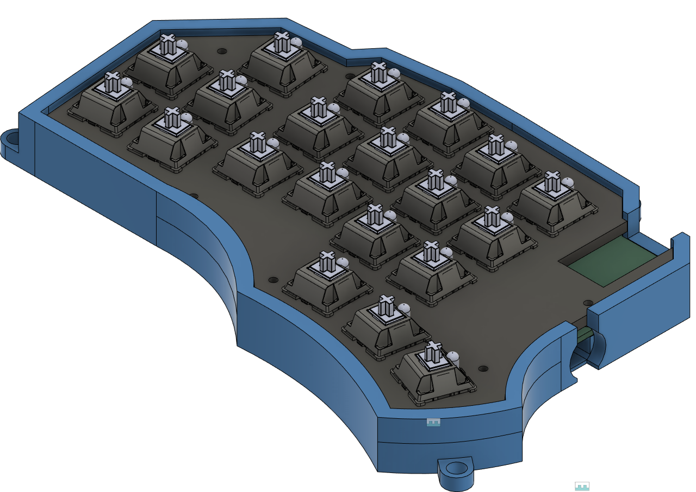  
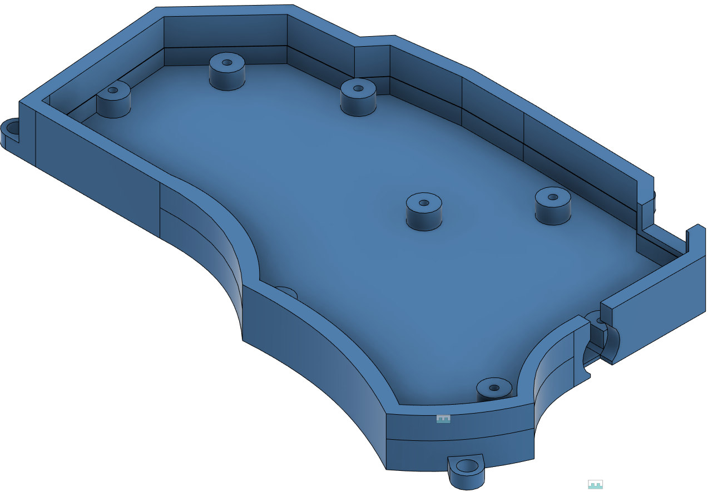
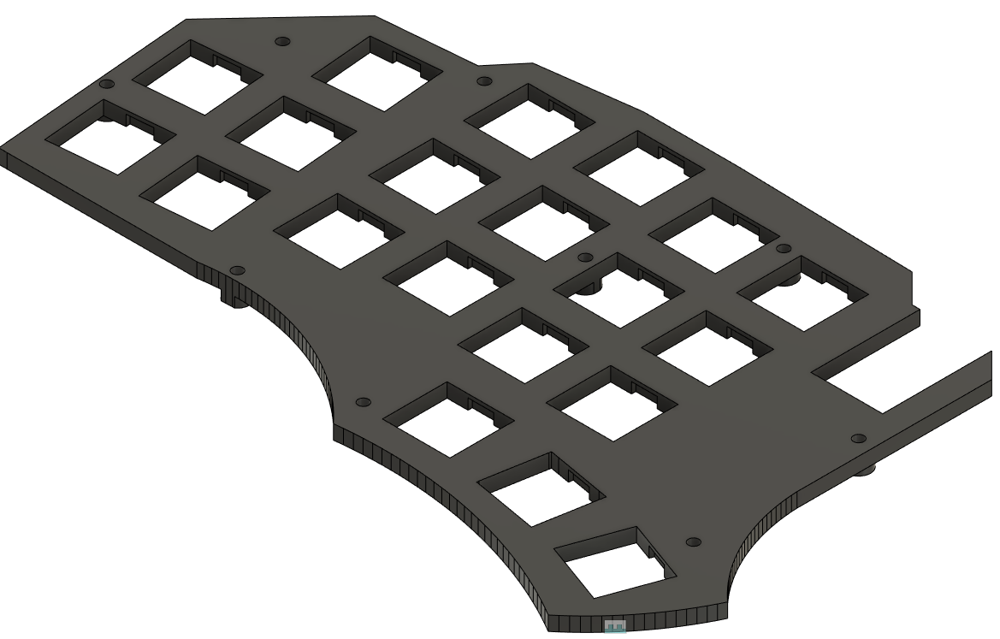

This case was not at all fun to design. Especially with that upside down audio jack. The PCBs weren't identical so I actually had to do some really weird things to a mirror of the left hand case to make it fit the right hand PCB. It took far longer than it should have, but fortunately I was able to make the PCBs identical for Rev2.

Overall, I feel like Rev1 was a really good learning experience for me, but this is by no means a good keyboard.

## Revision 2

I opted for Kailh Choc switches for this revision. I wanted to revisit my original intention of having a portable keyboard I could bring with me anywhere I needed to bring it. That just wasn't going to happen with the clunkier board using MX style switches.

### In Use (Daily Driver)

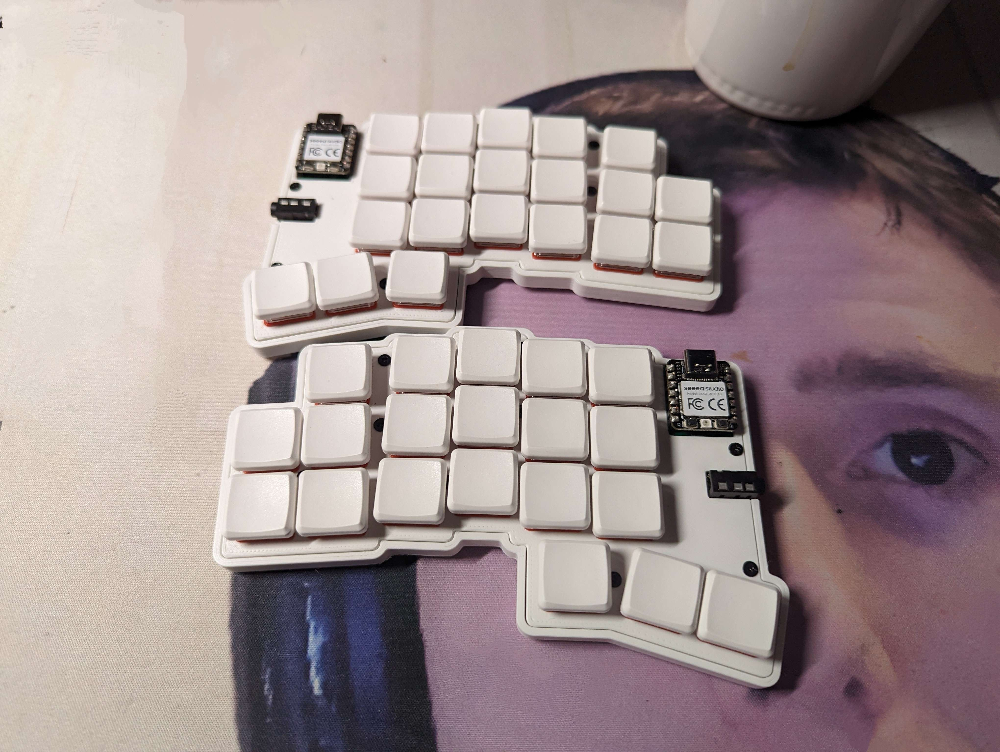
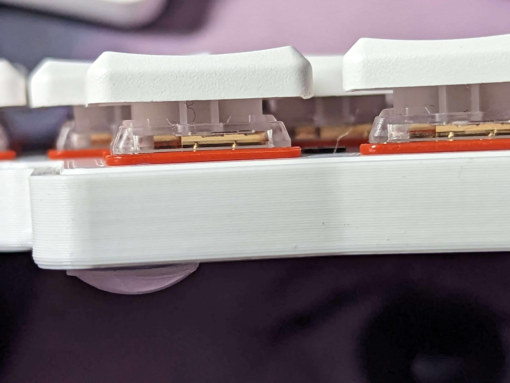

Again, don't mind the sad Linus mousepad.

I was worried about the plate sticking up above the frame of the case, but I actually really like how that turned out. I usually go for the plate being recessed into the case, but I think especially for these low profile designs, this is a much better fit.

With regards to the spacing, I have pretty much the opposite problem with this board. The columns are too close and the rows are... kind of perfect? Despite that, this is much more comfortable than Rev1.

### 3D Model
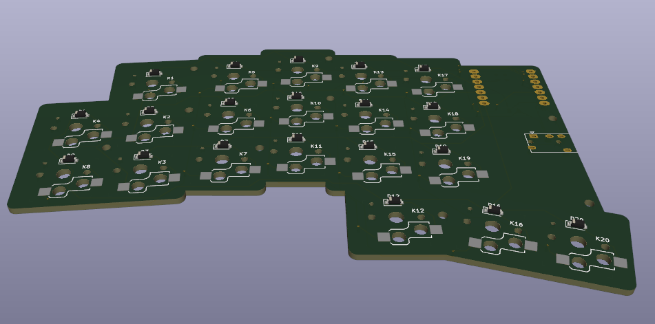

This is the underside of the right hand keyboard for the Rev2. One thing of note is the use of surface mounted
diodes instead of the through-hole diodes. This made routing the keyboard a lot easier, although the trade off
was that soldering wasn't nearly as easy. 

### PCB Schematic
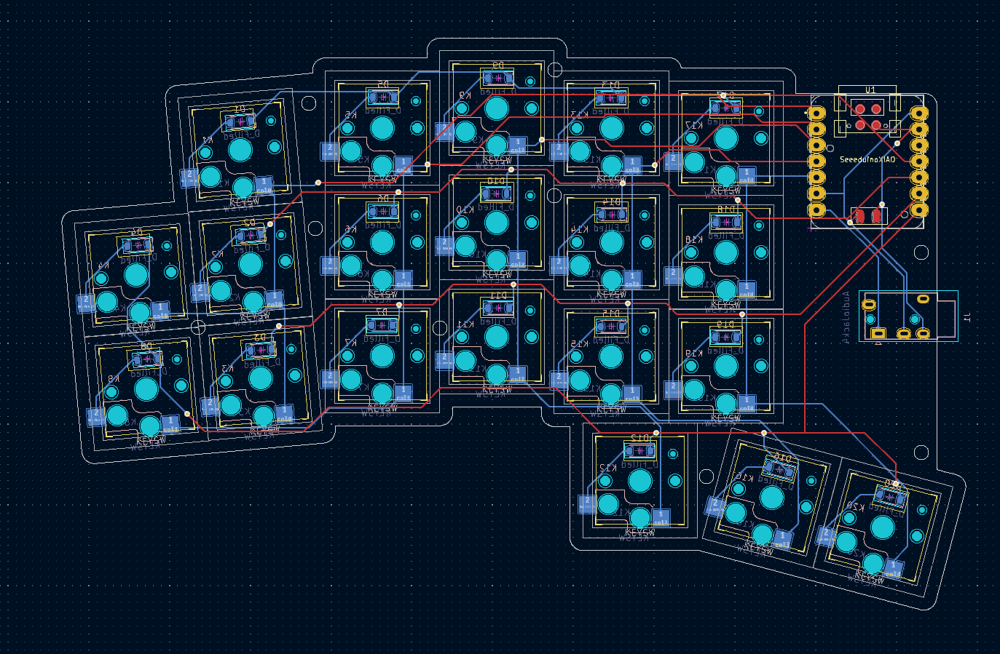
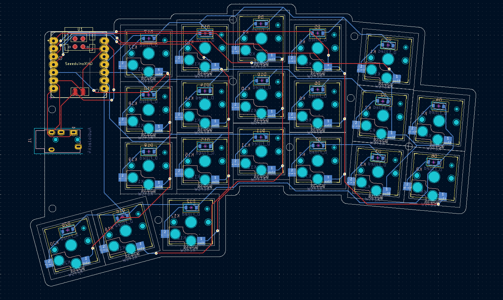

I will admit, I think the routing I did for this board is arguably worse than the first. I was just desperate to get this thing sent to an unsustainably cheap chinese PCB manufacturer and so I just routed as fast as I could without violating my DRC. 

I learned on a project I did right after this that on a 2 layer PCB and for a layout like this, you should allocate a side for vertical traces and the other side for horizontal traces. You live and you learn I guess. I added through-holes to the footprints for the Xiao RP2040 pads. It made soldering easier, but I wanted to be able to remove the Xiao for some reason. Anyway, the holes on the PCB and the Xiao do not line up 🙃.

Speaking of learning, the audio jack footprint was placed correctly this time and it now sits on the top side of the board.

### Models

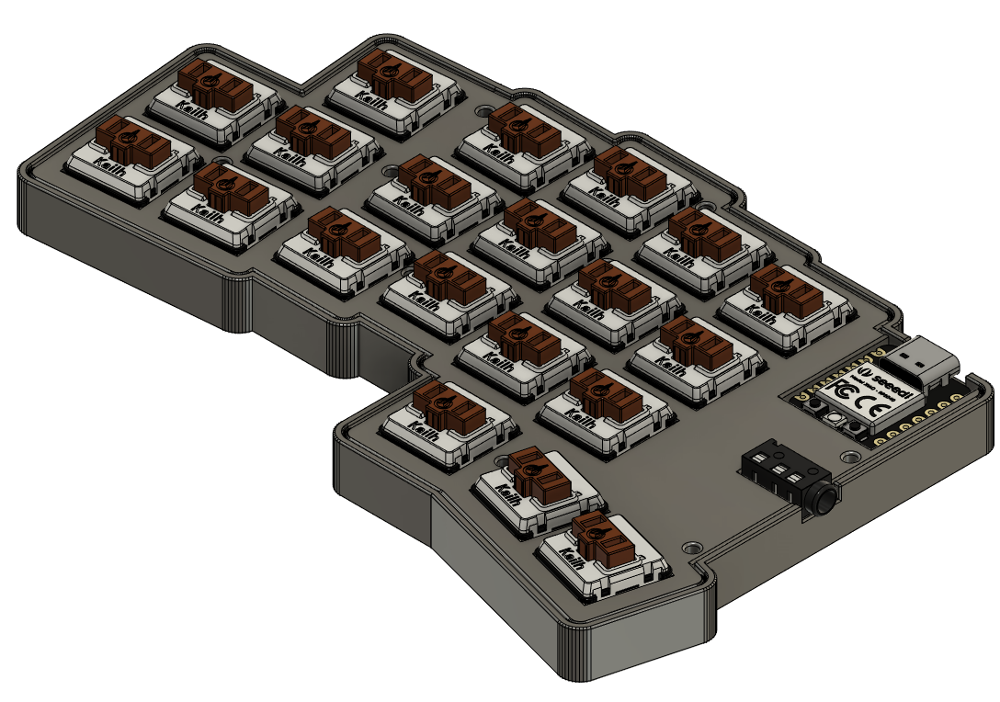  
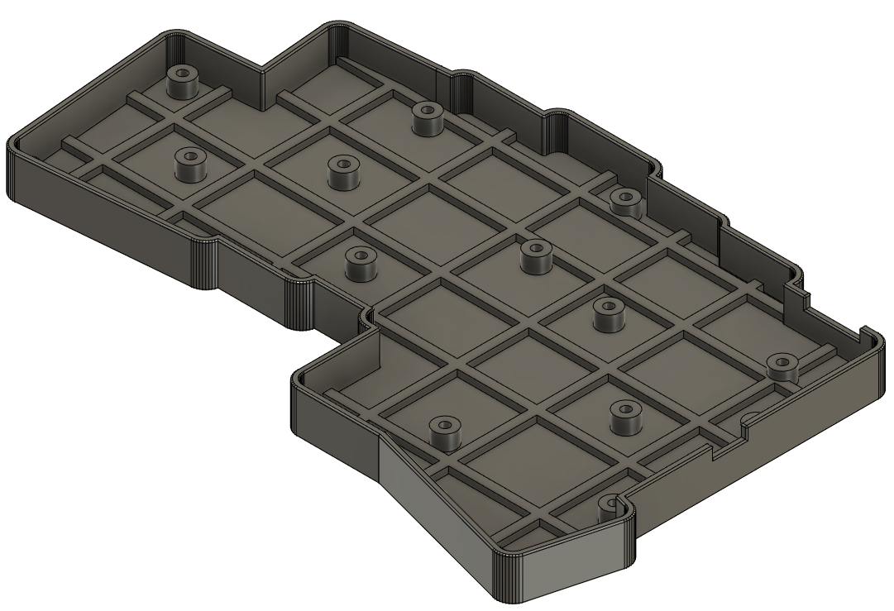
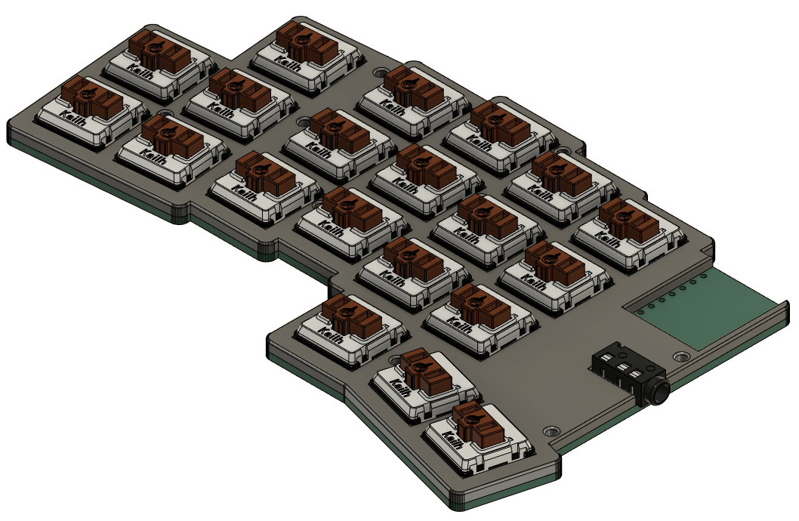

I wanted the case to be thin, but I also didn't want it to be flimsy... So I made it too tall because I didn't realize that fastening the PCB to the case would stiffen it considerably. Despite that, the overall height of the case was less than 2 cm, and fit snugly in my bag next to my laptop so I shall call that a win.

In the next iteration, the audio jacks are going to be removed in favour of a battery and micro-switch to power on each half of the board. That being said, I'm hoping to be able to keep the majority of the PCB and the case the same.
